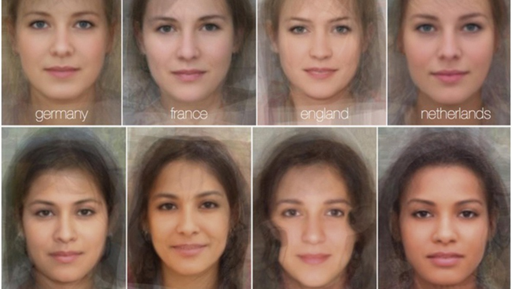
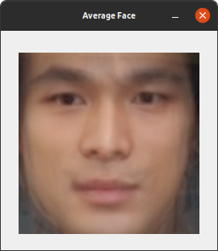

# title
僕のアプリが週刊誌取材を受けた話と、週刊誌に載せられなかったtech系の資料
# 環境


# はじめに
「女性自身」を発行している光文社様より、「江口洋介さんと松村北斗さんの顔が似ている検証をしてほしい」とのご依頼を受けました。
これまで「似ている芸能人」をブログで取り扱ったこともありました。
江口洋介さんといえば「あんちゃん」のイメージが私にはあります。はつらつとしてかっこよかったですね。
科学的に「似ている」かどうかを検証するために、顔画像の類似度を計算することにしました。
光文社様が権利を持つ写真を提供して頂き、最初の類似度を計算してみました。
お預かりした写真は現在のお二人の様子であり、お年が離れているため、類似度は低いと予想されます。
この記事ではお預かりした写真を使用することは出来ないため、インターネット上の写真を引用して使います。
使用した学習モデルは日本人専用学習モデルを使用しました。
EfficientNetV2--SネットワークとArcFaceLossを使用しています。
ここでは紙面の都合上乗せることの出来なかった検証結果や、検証に使用したコードを公開します。
紙面上ではなるべく専門用語をさけ一般の方向けに書きましたので、こちらではもっとtech系の内容を書いています。


## Grad-CAM
https://arxiv.org/pdf/1610.02391.pdf

この論文では「視覚化はクラスをより正確に識別し、分類器の信頼性をより適切に明らかにし、データセット内のバイアスを特定するのに役立つことが明らか」にしています。

Grad-CAM（Gradient-weighted Class Activation Mapping）は、畳み込みニューラルネットワーク（CNN）の特定のクラスへの予測の視覚的説明を生成する手法です。

Grad-CAMは、ネットワークの最後の畳み込み層の特徴マップに対するクラスの勾配を計算します。これらの勾配（ニューロンの重要度）は、特徴マップの各チャネルに対する重みとして解釈されます。これらの重み付き特徴マップを組み合わせることで、最終的なクラス活性化マップ（CAM）が生成されます。

このCAMは、ネットワークが特定のクラスを予測する際に、どの部分（またはどのニューロン）が重要であるかを視覚的に示します。要するに、CNNが特定のクラスを予測するために「注視」している画像の領域がどの領域なのかを視覚化してくれます。

## バイアスを明らかにする


この論文では、医師と看護師を識別するための実験が行われています。モデルは女性の医師を看護師と誤分類し、男性の看護師を医師と誤分類していました。これは、画像検索結果が性別に偏っていたためで、医師の画像の78%が男性で、看護師の画像の93%が女性でした。
Grad-CAMを使用した結果、モデルが人の顔や髪型を見て看護師と医師を区別することを学習していることが明らかになりました。これは**性別のステレオタイプを学習してしまっており、問題があります**。

この結果に鑑み、訓練セットのバイアスを減らすために、男性の看護師と女性の医師の画像を追加し、クラスごとの画像の数を維持した結果、再訓練されたモデルはより良く一般化され、テスト精度が90%に向上しました。また、適切な領域を見ていることも確認されました（図8の最後の列）。

この実験は、Grad-CAMが**データセットのバイアスを検出し、除去するのに役立つ**こと、そしてそれがより良い一般化だけでなく、社会でのアルゴリズムによる決定が増えるにつれて公正で倫理的な結果にも重要であることを示す証拠となりました。


## 分類エラーの理由を明らかにする
論文中の図9の(d)では、ロッカーに貼られている紙にニューロンが反応して、エレベーターと誤分類しています。この誤分類の理由を調べるために、Grad-CAMを使ってモデルがどの領域に注目しているのかを可視化しています。このように、Grad-CAMは**モデルが誤分類する理由を明らかにする**ことができます。


さてGradCAMを使ってお二人の顔画像を


目尻から鼻筋にかけて注視しているのがみてとれます。


口元から鼻筋にかけて注視しているのがみてとれます。

## Grad-CAMの実装
EfficientNet V2をベースとしたモデルを定義し、Grad-CAMの対象となる層をEfficientNet V2の最終的な畳み込み層であるself.trunk.blocks[-1]と指定しています。
```python

import numpy as np
import torch
from PIL import Image
from torchvision import transforms
import matplotlib.pyplot as plt
import cv2
import timm
from torch import nn
from pytorch_grad_cam import GradCAM

# モデルの定義
class CustomModel(nn.Module):
    def __init__(self, embedding_dim=512):
        super(CustomModel, self).__init__()

        # EfficientNet V2の事前学習済みモデルを取得し、trunkとして定義
        self.trunk = timm.create_model('tf_efficientnetv2_b0', pretrained=True)
        num_features = self.trunk.classifier.in_features

        # trunkの最終層にembedding_size次元のembedder層を追加
        self.trunk.classifier = nn.Linear(num_features, embedding_dim)

    def forward(self, x):
        return self.trunk(x)

input_image = "hokuto.png"

# 画像の前処理を定義
mean_value = [0.485, 0.456, 0.406]
std_value = [0.229, 0.224, 0.225]
transform = transforms.Compose([
    transforms.Resize((224, 224)),
    transforms.ToTensor(),
    transforms.Normalize(
        mean=mean_value,
        std=std_value
    )
])

# モデルのインスタンスを作成
pytorch_model = CustomModel()

# モデルの状態辞書をロード
state_dict = torch.load("best_model_169epoch_512diml.pth")

# 状態辞書をモデルに適用
pytorch_model.load_state_dict(state_dict)

# モデルを評価モードに設定
pytorch_model.eval()

# Grad-CAMのための最終層を指定
target_layer = pytorch_model.trunk.blocks[-1]

# Grad-CAMのインスタンスを作成
cam = GradCAM(pytorch_model, target_layer, use_cuda=False)

# 画像の読み込みと前処理
image = Image.open(input_image)
input_tensor = transform(image) # 前処理の適用
input_tensor = input_tensor.unsqueeze(0) # バッチ次元の追加

# Grad-CAMの実行
target_category = None
grayscale_cam = cam(input_tensor, target_category)

# ヒートマップの作成
grayscale_cam = grayscale_cam[0, :]
heatmap = cv2.applyColorMap(np.uint8(grayscale_cam * 255), cv2.COLORMAP_JET)
heatmap = cv2.cvtColor(heatmap, cv2.COLOR_BGR2RGB)  # 追加：ヒートマップの色の順序をRGBに変更

# 画像の読み込み
original_image = cv2.imread(input_image, cv2.IMREAD_COLOR)
original_image = cv2.cvtColor(original_image, cv2.COLOR_BGR2RGB)

# 画像とヒートマップのサイズが同じであることを確認
assert original_image.shape == heatmap.shape

# 画像とヒートマップをアルファブレンド
alpha = 0.5
blended = cv2.addWeighted(original_image, alpha, heatmap, 1 - alpha, 0)

# 結果を表示
plt.imshow(blended)
plt.show()
```
## Average face(平均顔)の作成
「平均顔」または「Average face」は、一連の顔画像の平均を取ることで生成される顔のイメージです。これは、一般的には、特定の集団（例えば、特定の国や地域の人々、特定の年齢層、特定の性別など）の「典型的な」顔を表現するために使用されます。
「平均顔」の概念は心理学の研究から生まれました。特に、顔の美しさや魅力に関する研究でよく使われています。


> 操作性を考慮した顔画像合成システム： FUTON—— 顔認知研究のツールとしての評価 ——
> https://search.ieice.org/data/d_data/j85-a_10_1126/10a_9.pdf
> 
>
> 
心理学者たちは、多くの人々が「平均的な」顔を魅力的だと感じることを発見しました。これは、平均顔が特定の集団の顔の特徴を代表しているため、その集団のメンバーにとっては親しみやすく、また認識しやすいという理由があると考えられています。

また、平均顔は一般的には顔の特徴が均整が取れているとされ、これが美しさと関連しているとも考えられています。つまり、個々の特徴が極端でなく、全体としてバランスが取れている顔が美しいと感じられるのです。

このように、平均顔は心理学の視点からも、人間の顔への認識や魅力の評価について理解するための重要なツールとなっています。
平均顔を作成するプロセスは次のように行われます：

1. まず、一連の顔画像を収集します。これらの画像は同じサイズである必要があり、顔の特徴（目、鼻、口など）が同じ位置に揃えられている必要があります。

2. 次に、各画像の各ピクセルの色値（通常はRGB値）の平均を計算します。これは、すべての画像をスタックし、各ピクセル位置での色値の平均を取ることで行われます。

3. この平均値を用いて新しい画像を生成します。この新しい画像が「平均顔」です。

この平均顔は、その集団の「典型的な」顔の特徴を表現します。例えば、特定の国や地域の人々の平均顔を作成すると、その地域の人々の顔の特徴が一般的にどのようなものであるかを視覚的に理解することができます。

なお、この手法は顔画像だけでなく、他の種類の画像にも適用することができます。また、平均を取るだけでなく、画像の中央値やモード（最頻値）を取ることで、異なる種類の「代表的な」画像を生成することも可能です。


- 男性芸能人の平均顔
  
- 植松北斗さんの平均顔
    
- 江口洋介さんの若い頃の平均顔
  
- 江口洋介さんの現在の平均顔
  
- 植松北斗さんの平均顔と江口洋介さんの若い頃の平均顔の混合


## 平均顔作成コード
顔認証ライブラリFACE01のサンプルコードをそのまま使用しています。
```python
"""License for the Code.

Copyright Owner: Yoshitsugu Kesamaru
Please refer to the separate license file for the license of the code.
"""

"""Example of calculating similarity from two photos with efficientnetv2_arcface.onnx model.

Summary:
    An example of loading face images with file names listed in 
    average_face.txt and creating an average face from those images.

Example:
    .. code-block:: bash
    
        python3 example/similarity.py
        
Source code:
    `similarity.py <../example/similarity.py>`_
"""
# Operate directory: Common to all examples
import cv2
import numpy as np
import os
import glob
import mediapipe as mp

# Initializing the Mediapipe face landmark detector
mp_face_mesh = mp.solutions.face_mesh  # type: ignore
face_mesh = mp_face_mesh.FaceMesh()

# Change directory where average_face.txt exists
root_dir = '/home/terms/ドキュメント/similarity_of_two_persons/tmp/mix'
os.chdir(root_dir)

def align_face(image):
    # Detecting face landmarks
    results = face_mesh.process(cv2.cvtColor(image, cv2.COLOR_BGR2RGB))

    if results.multi_face_landmarks:
        for face_landmarks in results.multi_face_landmarks:
            # Calculating the center of the face
            center = np.mean([[data.x, data.y] for data in face_landmarks.landmark], axis=0).astype("int")

            # Calculating the angle of the face
            dX = face_landmarks.landmark[33].x - face_landmarks.landmark[263].x
            dY = face_landmarks.landmark[33].y - face_landmarks.landmark[263].y
            angle = np.degrees(np.arctan2(dY, dX)) - 180

            # Calculating the center of the image
            (h, w) = image.shape[:2]
            (cX, cY) = (w // 2, h // 2)

            # Rotating the image to align the face frontally
            M = cv2.getRotationMatrix2D((cX, cY), angle, 1.0)
            aligned = cv2.warpAffine(image, M, (w, h), flags=cv2.INTER_CUBIC, borderMode=cv2.BORDER_REPLICATE)

            return aligned

png_list = glob.glob(f'{root_dir}/*.png')

images = []
for png_file in png_list:
    image = cv2.imread(png_file)
    aligned = align_face(image)
    resized = cv2.resize(aligned, (224, 224))  # type: ignore
    images.append(resized)

# Converting images to a numpy array
images = np.array(images)

# Calculating the average face
average_face = np.mean(images, axis=0).astype("uint8")

# Displaying the average face
cv2.imshow("Average Face", average_face)
cv2.waitKey(0)


````

# 結論

# 詳細

# 参考リンク

# あとがき
